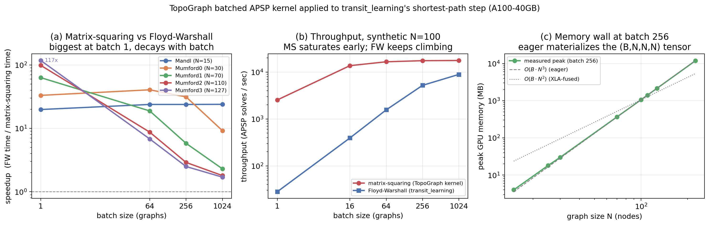

# transit_learning APSP comparison harness

Benchmarks TopoGraph's batched APSP kernel (min-plus matrix-squaring) against
[transit_learning](https://github.com/.../transit_learning)'s
`torch_utils.floyd_warshall` on the **same shortest-path workload**, to answer:
*does the kernel that gave TopoGraph its 50–60× GPU speedup also speed up
transit_learning's shortest-path step?*

Both projects solve the identical core problem — batched all-pairs shortest
paths over transit graphs. transit_learning computes it with a vectorized
Floyd-Warshall on the hot path (`transit_time_estimator.py:_update_route_data`
→ `tu.floyd_warshall`); TopoGraph computes it with fixed-iteration min-plus
matrix-squaring (`D ← min(D, D⊕D)`). This harness puts them head to head.

## Files

| File | What it is |
|---|---|
| `apsp_matrix_squaring.py` | PyTorch port of TopoGraph's JAX kernel (`ParallelTopo/src/topograph/sim_gpu/apsp.py`). Single + batched. |
| `data_loader.py` | Loads real Mandl/Mumford edge-cost matrices; generates synthetic batched graphs for throughput sweeps. |
| `compare.py` | The harness: distance-equivalence, convergence-K sweep, and CPU/GPU throughput. |
| `modal_throughput.py` | Runs the whole sweep on a Modal A100 (the GPU speedup figure). |

## Setup

The harness imports transit_learning's *actual* `floyd_warshall` as the
baseline, so it needs that repo and a torch environment. Use transit_learning's
own venv (it only needs `torch` for this path):

```bash
cd /Users/dannymo/dev/transit_learning
source .venv/bin/activate          # has torch installed
cd /Users/dannymo/dev/ParallelTopo/transit_learning
python compare.py all
```

If transit_learning lives elsewhere, pass `--tl-root /path/to/transit_learning`.
The Mandl/Mumford matrices are read from
`transit_learning/datasets/mumford_dataset/Instances` by default
(`--instances-dir` to override).

## Usage

```bash
python compare.py all                              # all three experiments
python compare.py equiv                            # distance equivalence only
python compare.py ksweep                           # convergence-K only
python compare.py throughput --device cuda --batch 1 16 64 256 1024
python compare.py throughput --throughput-city Mumford3   # real graph, replicated
python compare.py throughput --synth-n 225                # synthetic 225-node graphs
```

## GPU run (the speedup figure)

Run the sweep on an A100 via Modal:

```bash
pip install modal && modal setup        # one time
modal run modal_throughput.py           # ~runs unattended; safe to leave overnight
```

It uploads the harness, transit_learning's `torch_utils.py`, and the
Mandl/Mumford instances; runs `equiv` + `ksweep` (GPU sanity) then a synthetic
graph-size × batch sweep and a real-city sweep; prints everything and saves a
timestamped log to `results/transit_learning_gpu/`. Per-cell OOMs are caught and
reported (not fatal) — torch eager will hit a memory ceiling at large
batch × N that XLA fusion avoided in TopoGraph, and that contrast is a finding,
not a bug. Edit `TL_ROOT` at the top of the script if transit_learning lives
elsewhere; batch lists are bounded per N to stay under 40 GB.

## What the experiments show

**`equiv`** — runs matrix-squaring at a conservative `K` (2^K ≥ N−1) and checks
its distances against FW, treating `+inf == +inf` as a match. Expectation:
exact agreement within fp32 round-off.

**`ksweep`** — finds the smallest `K` at which matrix-squaring is bit-exact vs
FW per city, and reports whether TopoGraph's default `K=5` suffices. This
matters because TopoGraph's K=5 is justified by *grid-city* hop-diameters;
real transit topologies need their own check.

**`throughput`** — median APSP-solves/sec for FW vs matrix-squaring over a batch
sweep, on CPU and (with `--device cuda`) GPU, plus peak GPU memory. This is the
speedup figure.

## Verified result (numpy reference, 2026-06-01)

The matrix-squaring math was validated against an exact Floyd-Warshall
reference on all five real graphs (run in fp64; the PyTorch kernel is the same
algorithm). **Matrix-squaring is bit-exact vs Floyd-Warshall on every graph**,
and `K=5` — TopoGraph's grid-city default — is exact for all of them:

| city | N | conservative K | min exact K | K=5 exact? |
|---|---:|---:|---:|:--:|
| Mandl | 15 | 5 | 3 | yes |
| Mumford0 | 30 | 6 | 3 | yes |
| Mumford1 | 70 | 8 | 4 | yes |
| Mumford2 | 110 | 8 | 4 | yes |
| Mumford3 | 127 | 8 | 4 | yes |

The Mandl/Mumford travel-time graphs have small hop-diameters, so
matrix-squaring converges in even fewer iterations than the conservative
`⌈log2(N−1)⌉` bound. The accuracy half of the port carries over cleanly.

## GPU throughput result (Modal A100-40GB, 2026-06-01)

`modal run modal_throughput.py`; full log in
`results/transit_learning_gpu/gpu_throughput_20260601T0823*.txt`, figure in
`results/transit_learning_gpu/gpu_throughput_figure.png`.

**Speedup = Floyd-Warshall time / matrix-squaring time** on the real cities
(median of 30 calls):

| city | N | batch 1 | batch 64 | batch 256 | batch 1024 |
|---|---:|---:|---:|---:|---:|
| Mandl | 15 | 19.8× | 23.8× | 23.8× | 23.9× |
| Mumford0 | 30 | 33.1× | 40.5× | 31.3× | 9.2× |
| Mumford1 | 70 | 63.0× | 18.8× | 5.8× | 2.3× |
| Mumford2 | 110 | 98.4× | 8.7× | 2.9× | 1.8× |
| Mumford3 | 127 | 117.4× | 6.8× | 2.5× | 1.7× |

Three findings:

1. **Biggest at low batch / large graph, decaying with batch.** Matrix-squaring
   needs only `K = ⌈log2 N⌉` sequential GPU steps versus Floyd-Warshall's `N`, so
   it wins most where FW is latency-bound on its `N` dependent launches — up to
   **117× at batch 1 on Mumford3**. As batch grows, FW amortizes that overhead
   and the gap closes to ~1.5–2×.
2. **Matrix-squaring saturates early; FW keeps climbing.** At synthetic N=100,
   MS throughput pins at ~17.7k solves/sec by batch 64 while FW rises from 28 →
   8,918 solves/sec across the batch sweep — both converge toward the
   compute-bound limit, where FW's lower total work lets it catch up.
3. **Eager hits an O(B·N³) memory wall.** Peak memory tracks `B·N³` (11.8 GB at
   N=225/batch 256; N=400 OOMs past batch 64) because PyTorch eager materializes
   the `(B,N,N,N)` min-plus intermediate — the tensor XLA *fused away* in
   TopoGraph (O(B·N²)). Batch-scaling here depends on fusion, not the algorithm.

The clearest practical win is the latency-bound, low-batch regime that
transit_learning's evolutionary inner loop actually runs in. See
`gpu_throughput_figure.png` (regenerate with `python plot_results.py`).



## Two caveats

1. **Distances only, not paths.** transit_learning's FW returns both `dists`
   *and* the `nexts` predecessor matrix, and downstream route logic
   (`reconstruct_all_paths`, `shortest_path_sequences`) needs the paths.
   Matrix-squaring produces distances only. So this kernel is a drop-in for the
   *distance* half of FW; replacing FW wholesale would require adding
   predecessor tracking (which matrix-squaring does not give cheaply).

2. **JAX → PyTorch.** TopoGraph's kernel is JAX; this is a faithful PyTorch
   re-implementation so the comparison runs inside one runtime, with no
   JAX↔Torch interop overhead confounding the timing. The algorithm — K
   min-plus matrix-squarings — is identical.
